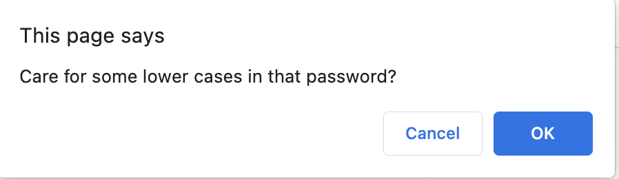

# Challenge3

## Description

This week I was given a starter code for a password generator website. I created a prompt and confirm buttons where the user can choose the length of their new password, and customize whether they want their password to have lower case letters, upper case letters, numbers, or special characters.

### Screenshots

### Link
